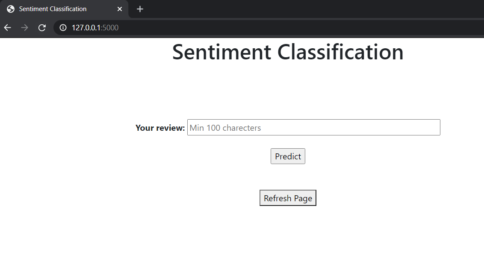
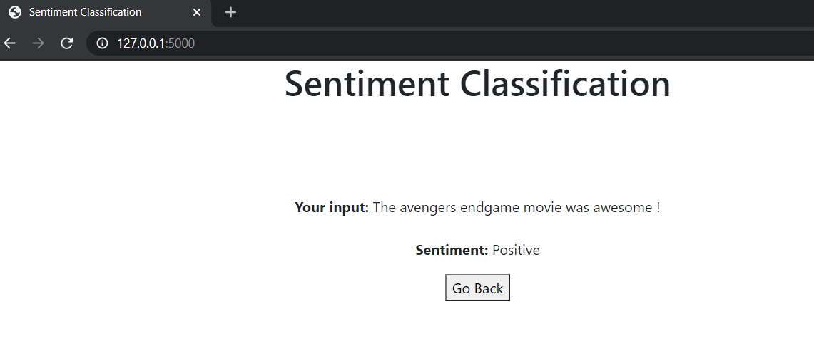
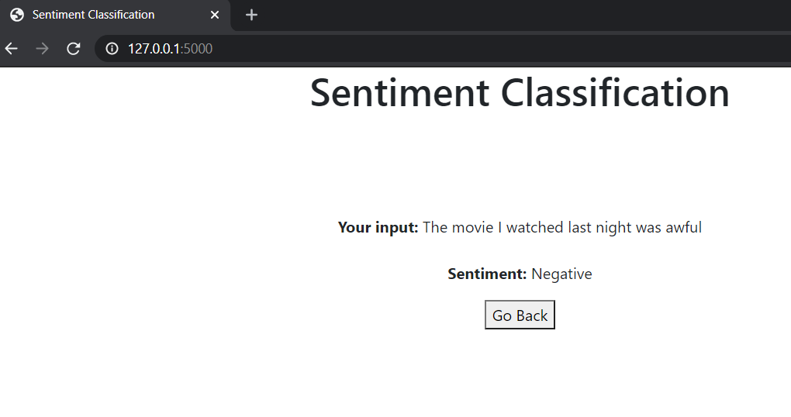

# Sentiment Prediction

A simple sentiment prediction webapp using Flask.

Before proceeding please install all the dependencies using the requirements.txt file in the root folder by using,

```pip install -r requirements.txt``` or ```python -m pip install -r requirements.txt```


To start the app, head over to **app/** directory which contains the **models/**, **templates/** folders and **app.py** file which contains the actual flask app.

Start the app by using the command, ```python app.py```, if all the dependencies are installed properly you can see the app running at ```127.0.0.0/5000``` or ```localhost/5000``` in your browser as follows.


APP home
----



Positive Prediction
---- 




Negative Prediction
----



